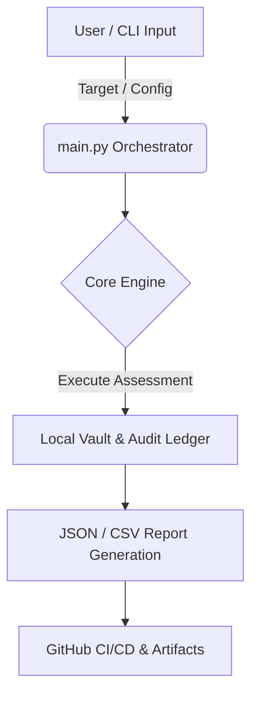

# GHOST-WebScanner - Architecture & System Design

> Developed by Abdulaziz (Ghost-SY1).

---

## 1. System Overview
This document outlines the architectural flow, component interaction, and evidentiary pipelines for **GHOST-WebScanner**.

## 2. Architecture Diagram (Mermaid)

## 3. Data Flow & Security Controls
- **Input Sanitization**: All targets and payloads are validated against strict formatting rules.
- **Integrity Verification**: Output telemetry is hashed using SHA-256 to ensure tamper-evidence.
- **Execution Lifecycle**: Terminal buffers are cleared, official Ghost-SY1 banner is rendered, and execution proceeds under strict authorization.

---
