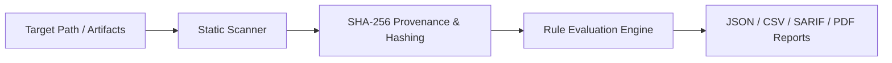

# GHOST-WebScanner Architecture

## Overview
`GHOST-WebScanner` is built under the Ghost-SY1 v4.0-PRO standard. It operates locally on operator-provided files or directories, calculates SHA-256 evidence hashes, evaluates security rule sets, and outputs structured audit data.

## Security Boundaries
- **Zero Network Access**: No outbound requests, sockets, or telemetry.
- **Zero Execution**: Analyzed files are parsed textually or structurally without dynamic execution.
- **Provenance**: Every artifact is tracked by absolute path, size, and SHA-256 digest.
